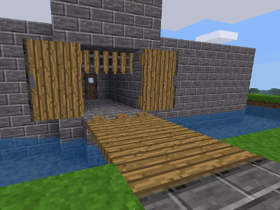

# Castle Gates

License: MIT (see [LICENSE](LICENSE))

### Features

 * Normal oak and steel doors
 * Sliding doors
 * Swinging doors

This allows the construction of portcullises and drawbridges as well as conventional swinging doors.
Use the screwdriver to reorient gate pieces as needed for these purposes.

The modding API is documented here: [api.txt](api.txt)

### Dependencies

 * Minetest 5.0.0 or newer
 * Minetest Game compatible `default` mod

